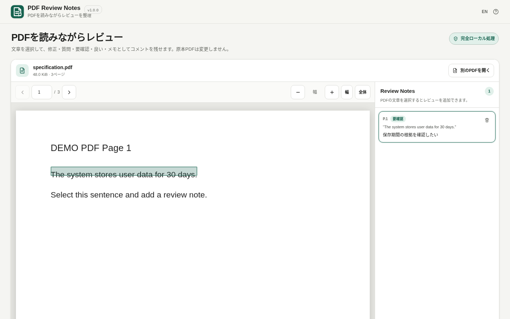

# PDF Review Notes

[](https://github.com/ttomohisa/htmlapps-pdf-review-notes/actions/workflows/deploy-pages.yml)
[](LICENSE)
[](https://ttomohisa.github.io/htmlapps-pdf-review-notes/)

[English README](README.md)

PDF Review Notes は、PDFの文章を選択してレビューコメントを付け、原本PDFを変更・アップロードせずに指摘を整理するブラウザーツールです。

**現在の正式版: v1.0.0。**

## デモ

### [GitHub PagesでPDF Review Notesを開く](https://ttomohisa.github.io/htmlapps-pdf-review-notes/)

GitHub Pagesから最初のHTMLを取得した後、選択したPDFとレビュー内容はブラウザー内で処理します。PDFやコメントをアプリから外部サーバーへ送信しません。

[](https://ttomohisa.github.io/htmlapps-pdf-review-notes/)

## v1.0.0でできること

- テキスト / 矩形レビューの追加・編集・削除・再確認
- レビューごとの 未対応 / 解決済み 管理
- PDFごとの自動保存 / 再開（SHA-256で識別）
- **Markdown / CSV / 単一HTMLレポート書き出し**
- 作業データJSONの書き出し / 読み込み
- 状態・種類での絞り込み、ページ順 / 追加順の並び替え
- PDF.js による完全ローカル表示
- PCでは **Shift + ドラッグ** ですぐ矩形レビュー
- PDF上で **Ctrl + ホイール** によるカーソル位置基準の拡大縮小
- PC用ショートカットはインフォボタン内へまとめ、ツールバーを圧迫せず確認可能
- 保存先IDなどの内部情報を表に出さず、自動保存状態を平易に表示

## 詳細な機能一覧

- **PDF.jsを内包** — 固定版のPDF.js本体とWorkerをビルド時にHTMLへ埋め込み、実行時CDNを使いません。
- **PDF本文を選択** — Canvas表示の上にPDF.js Text Layerを重ね、文章をドラッグ選択できます。
- **5種類のレビュー** — 修正 / 質問 / 要確認 / 良い / メモ。
- **PDF座標で位置を保持** — 選択範囲を画面ピクセルではなくPDF座標で持ち、倍率変更や再描画後も同じ箇所へハイライトを戻します。
- **レビュー一覧から戻る** — Review Notesを選ぶと該当ページ・位置へ移動します。
- **誤破棄を防止** — レビューが残っている状態で別のPDFを開く場合は、破棄確認を表示します。
- **削除 + Undo** — 1件削除はすぐ実行し、トーストから元に戻せます。
- **Markdown書き出し** — ページごとにレビューを整理し、引用・コメント・状態を読みやすい形式で保存します。
- **CSV書き出し** — UTF-8（BOM付き）で、表計算ソフトへ持ち込みやすい形に保存します。
- **単一HTMLレポート** — 相手がPDF Review Notesを持っていなくても閲覧できます。原本PDFを標準で内包し、本体と同じPDF.jsプレビューを左側に表示します。レビューを押すと該当ページ・位置へ移動し、原本PDFの保存もできます。軽量化したい場合は原本PDFを含めない設定も選べます。
- **出力前確認** — 合計 / 未対応 / 解決済みの件数とファイル名を確認してから保存できます。
- **統一したPDF操作** — 前後ページ、ページ番号、拡大縮小、幅合わせ、ページ全体をアプリ側で処理します。
- **PC / スマートフォン** — PCはPDF＋レビューの2ペイン、スマホはPDF / レビューの下部タブです。
- **日本語 / 英語** — ページ再読み込みなしで切り替えます。
- **完全ローカル処理** — `connect-src 'none'`。PDFアップロード、Analytics、Telemetry、外部APIを使いません。
- **単一HTML** — テンプレートから通常版と自己展開版を生成します。

## 使い方

1. `.pdf` をドロップするか **PDFを選択** を押します。
2. レビューしたい文章があるページへ移動します。
3. PDF本文をドラッグして選択します。
4. **修正 / 質問 / 要確認 / 良い / メモ** を選びます。
5. コメントを書いて追加します。
6. Review Notesの項目を押すと、元のページ・選択位置へ戻れます。
7. 不要な項目は削除できます。直後なら **元に戻す** で復元できます。

## 入力制限

- `.pdf` 1ファイル
- 最大 **250 MiB**
- **100 MiB**超では処理負荷の警告を表示
- PDF.jsへ渡す前に `%PDF-` シグネチャを端末内で確認

## プライバシー

生成HTMLのContent Security Policyでは `connect-src 'none'` を維持します。

PDFとレビュー内容はアプリから:

- 外部へアップロードしません
- APIへ送信しません
- サーバーへ保存しません
- Analytics / Telemetryへ送りません
- 原本PDFを書き換えません

GitHub Pages版は最初のHTML取得には通信が必要です。ネットワークから切り離して利用するときは生成済みの `dist/index.html` を直接開いてください。

## 現在の制限

v1.0.0は初回正式リリースです。PDF編集全般へ広げず、レビュー・作業再開・レビュー結果の共有に範囲を絞っています。

- PDF.js Worker資産はHTMLへ埋め込み、`file://`では外部Worker URLに依存しないfake-worker経路を使用します。
- レビューはこの端末のIndexedDBへ自動保存します。同じPDFを開くと復元できます。
- Markdown / CSVはレビュー結果だけを書き出します。HTMLレポートは原本PDFを標準で内包し、必要ならOFFにできます。矩形レビューの選択範囲画像も任意で埋め込めます。
- HTMLレポートは対応ブラウザでは自動でgzip自己圧縮し、非対応の場合は通常HTMLへ自動フォールバックします。
- 画像だけのスキャンPDFや図表にも、矩形を使った範囲レビューを付けられます。
- パスワード保護PDFはこの段階では未対応です。
- v1.0.0で埋め込むPDF.js資産は本体とWorkerです。特殊な非埋め込みCMap、標準フォント資産、ICC、コーデック資産を必要とするPDFでは表示制限が出る場合があります。外部ネットワークへフォールバックはしません。

## v1.0.0までの開発履歴

| Version | Milestone |
| --- | --- |
| v0.1.0 | PDF Viewer Foundation |
| v0.2.0 | Text Review |
| v0.3.0 | Review Workflow |
| v0.4.0 | Area Review |
| v0.5.0 | Persistence / Resume |
| v0.6.0 | Markdown / CSV Export |
| v0.7.0 | Standalone HTML Review Report |
| v0.8.0 | UI / UX Finish |
| v0.9.0 | Release Candidate / Regression |
| **v1.0.0** | **正式リリース — 現在** |

詳細は [APP_SPEC.md](APP_SPEC.md) を参照してください。

## 開発 / ビルド

Windowsでは以下を実行します。

```bat
build-standalone.bat
```

初回ビルドではlockファイルで固定した依存tarballを取得し、SHA-256を確認してPDF.js本体/WorkerをHTMLへ埋め込みます。その後、通常版と自己展開版を生成します。

## 依存ライブラリ

| Library | Version | License | 用途 |
| --- | ---: | --- | --- |
| PDF.js (`pdfjs-dist`) | 6.2.108 | Apache-2.0 | PDF解析・描画、Text Layer、PDF座標変換 |

詳細は [THIRD_PARTY_NOTICES.md](THIRD_PARTY_NOTICES.md) を参照してください。

## 対応ブラウザー

固定したPDF.jsとBrowser Kitty standalone runtimeが対象とする、現在のデスクトップ / モバイル版 Chromium、Firefox、Safariを対象とします。

## License

Copyright © 2026 ttomohisa

[MIT License](LICENSE) で公開します。
