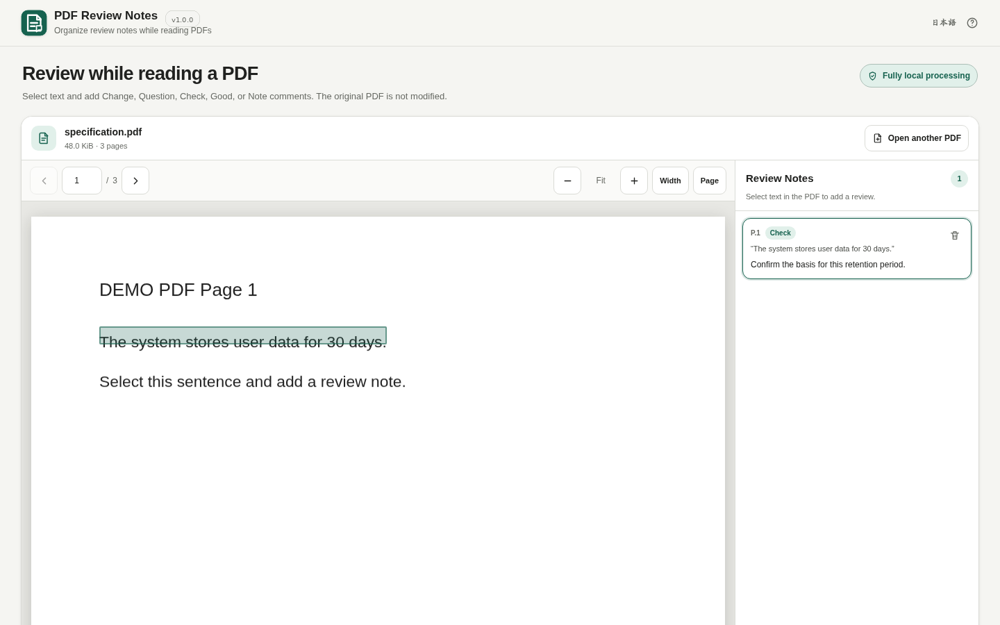

# PDF Review Notes

[](https://github.com/ttomohisa/htmlapps-pdf-review-notes/actions/workflows/deploy-pages.yml)
[](LICENSE)
[](https://ttomohisa.github.io/htmlapps-pdf-review-notes/)

[日本語版 README](README.ja.md)

PDF Review Notes is a local-first PDF review tool. Select text in a PDF, attach a structured review comment, and return to the anchored passage without modifying or uploading the original PDF.

**Current release: v1.0.0.**

## Live demo

### [Open PDF Review Notes on GitHub Pages](https://ttomohisa.github.io/htmlapps-pdf-review-notes/)

The initial HTML is delivered by GitHub Pages. After that, the selected PDF and review content are processed in the browser. The app does not upload the PDF or review comments.

[](https://ttomohisa.github.io/htmlapps-pdf-review-notes/)

## Features in v1.0.0

- Add, edit, delete, and revisit text or rectangular area reviews
- Track each review as Open or Resolved
- Autosave per PDF with SHA-256 identification and restore on reopen
- Export review results as Markdown, UTF-8 CSV, or standalone HTML
- Export/import session JSON for backup and resume
- Filter reviews by status and type, and sort them by page or creation order
- PDF.js rendering stays fully local and pinned
- **Shift + drag** starts a temporary rectangular Area Review on desktop
- **Ctrl + wheel** zooms the PDF around the pointer position
- A compact info popover documents the desktop viewer shortcuts without taking permanent toolbar space
- Autosave status uses plain language rather than exposing internal document IDs

## Detailed feature list

- **Embedded PDF.js viewer** — PDF.js and its worker are pinned and embedded into the built HTML; no runtime CDN is used.
- **Selectable PDF text** — Canvas rendering is paired with a PDF.js Text Layer.
- **Five review types** — Change, Question, Check, Good, and Note.
- **PDF-coordinate anchors** — Text selection rectangles are stored in PDF coordinates so highlights can be restored after zoom or page re-rendering.
- **Review list navigation** — Select a review to jump back to its page and anchored passage.
- **Per-PDF autosave** — Reviews are restored automatically when the same PDF is reopened.
- **Delete with Undo** — Single-review deletion is immediately reversible through the app toast.
- **Standalone HTML report** — Export a self-contained review result with local Open / Resolved filters. The original PDF is embedded by default and rendered with the same bundled PDF.js viewer style as the app; review cards jump to their saved PDF locations, and the recipient can save the source PDF. Users can opt out for a lighter file.
- **Consistent page controls** — Previous/next, page input, zoom, fit width, and fit page are handled by the app rather than browser-specific PDF URL fragments.
- **Desktop and smartphone layouts** — Desktop uses a PDF + review split view; mobile uses PDF / Reviews bottom destinations.
- **Japanese and English UI** — Switch language without reloading.
- **Fully local processing** — `connect-src 'none'`, no analytics, upload, cloud storage, or runtime API call.
- **Single HTML distribution** — The template produces readable and self-extracting standalone HTML variants.

## Usage

1. Drop a `.pdf` into the page or choose **Choose PDF**.
2. Navigate to the passage you want to review.
3. Drag across selectable PDF text.
4. Choose **Change / Question / Check / Good / Note** from the review-type menu.
5. Enter a comment and add the review.
6. Select a Review Notes item to return to its anchored passage.
7. Delete an item when needed; use **Undo** from the toast to restore it.

## Input limits

- One `.pdf` at a time
- Maximum size: **250 MiB**
- Files over **100 MiB** show a performance warning
- A local `%PDF-` signature check runs before PDF.js loads the document

## Privacy

The generated app keeps `connect-src 'none'` in its Content Security Policy.

The selected PDF and review text:

- are not uploaded by the app,
- are not sent to an API,
- are not stored on a server,
- are not used for analytics or telemetry,
- do not modify the original PDF.

The GitHub Pages version still requires the initial HTML request. For disconnected use, open the built `dist/index.html` directly.

## Current limitations

v1.0.0 is the first formal release. The feature set is intentionally focused on reviewing, resuming, and exporting review notes without turning the app into a general PDF editor.

- Reviews are autosaved in IndexedDB on this device and can be exported/imported as session JSON.
- Markdown / CSV contain review results only. HTML reports embed the original PDF by default, with an option to exclude it for a lighter report.
- Area-review crops can optionally be embedded in the HTML report as data images for quick visual reference.
- Standalone HTML reports are gzip self-compressed automatically when the browser supports it; otherwise export falls back to normal HTML automatically.
- PDF.js runs from embedded assets; `file://` uses the embedded fake-worker path so it does not depend on a cross-origin worker URL.
- Image-only scanned PDFs, figures, and charts can be reviewed with Area review rectangles.
- Password-protected PDFs are not supported in this milestone.
- Only PDF.js main/worker code is embedded in v1.0.0. Unusual PDFs that depend on non-embedded CMaps, standard-font resources, ICC profiles, or codec assets may have rendering limitations. The app does not fall back to a network resource.

## Development history

| Version | Milestone |
| --- | --- |
| v0.1.0 | PDF Viewer Foundation |
| v0.2.0 | Text Review |
| v0.3.0 | Review Workflow |
| v0.4.0 | Area Review |
| v0.5.0 | Persistence / Resume |
| v0.6.0 | Markdown / CSV Export |
| v0.7.0 | Standalone HTML Review Report |
| v0.8.0 | UI / UX Finish |
| v0.9.0 | Release Candidate / Regression |
| **v1.0.0** | **Formal Release — current** |

See [APP_SPEC.md](APP_SPEC.md) for the product contract.

## Development

```text
.
├─ AGENTS.md
├─ APP_SPEC.md
├─ app.config.json
├─ dependencies.json
├─ dependencies.lock.json
├─ assets/
├─ src/index.template.html
├─ build-standalone.bat
├─ build-standalone.ps1
└─ dist/
```

### Build on Windows

```bat
build-standalone.bat
```

The first build downloads the exact dependency tarball pinned by the lock file, verifies its SHA-256, embeds the configured PDF.js assets, and generates both standalone HTML variants.

## Dependencies

| Library | Version | License | Purpose |
| --- | ---: | --- | --- |
| PDF.js (`pdfjs-dist`) | 6.2.108 | Apache-2.0 | PDF parsing/rendering, selectable text layer, PDF/view coordinates |

See [THIRD_PARTY_NOTICES.md](THIRD_PARTY_NOTICES.md).

## Browser support

Target: current desktop/mobile Chromium, Firefox, and Safari supported by the pinned PDF.js build and the Browser Kitty standalone runtime.

## Contributing

Bug reports and feature proposals are welcome through GitHub Issues. See [CONTRIBUTING.md](CONTRIBUTING.md).

## License

Copyright © 2026 ttomohisa

Licensed under the [MIT License](LICENSE).
